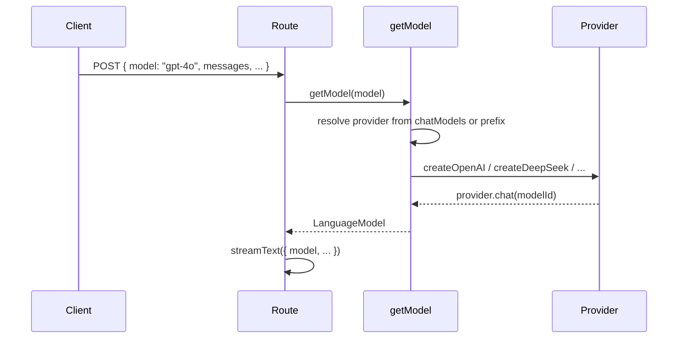

# 抽象多供应商 Model 动态切换

## 现状

- [packages/rag-chatbot/app/(chat)/api/chat/route.ts](packages/rag-chatbot/app/(chat)/api/chat/route.ts)：在 POST 内直接 `createDeepSeek(...)` 并 `deepseek.chat(model)`，自定义 fetch 用于注入参数。
- [packages/rag-chatbot/app/(chat)/actions.ts](packages/rag-chatbot/app/(chat)/actions.ts)：同样直接 `createDeepSeek` + `deepseek.chat(model)` 用于生成标题。
- [packages/rag-chatbot/lib/ai/models.ts](packages/rag-chatbot/lib/ai/models.ts)：已有 `chatModels`（id、provider、name），当前仅 deepseek、xiaomi；前端用 `model`（即 chatModels[].id）请求。

## 方案

### 1. 新增统一 Provider 模块 `lib/ai/provider.ts`

- **职责**：根据 `modelId` 返回 AI SDK 的 `LanguageModel`，供 `streamText` / `generateText` 使用。
- **解析逻辑**（二选一或组合）：
  - **优先**：用 [lib/ai/models.ts](packages/rag-chatbot/lib/ai/models.ts) 的 `chatModels` 按 `id` 查到的 `provider` 字段决定用哪家（与前端下拉一致）。
  - **兜底**：若未在 chatModels 中找到，则按 `modelId` 前缀推断（如 `deepseek-` → DeepSeek，`gpt-`/`o1-` → OpenAI，`gemini-` → Google，`glm-` → 智谱，`mimo-` → xiaomi/OpenAI 兼容）。
- **供应商实例**：
  - 各供应商（DeepSeek、OpenAI、Google、智谱等）在模块内**按需创建**（可懒加载单例，避免每次请求 new）。
  - **DeepSeek**：保留当前 route 中的自定义 `fetch`（解析 body、注入如 thinking 等参数）迁移到此处创建 `createDeepSeek` 时传入。
  - **OpenAI**：`createOpenAI({ apiKey: OPENAI_API_KEY })`，无 baseURL 或按需配。
  - **Xiaomi/Mimo**：与现有一致，用 OpenAI 兼容接口 `createOpenAI({ apiKey, baseURL })`（沿用 `OPENAI_BASE_URL`/`OPENAI_API_KEY`）。
  - **Google**：`createGoogle({ apiKey: GOOGLE_GENERATIVE_AI_API_KEY })`，调用 `.chat(modelId)`。
  - **智谱**：使用社区包（如 `ai-sdk-zhipu`）创建实例并 `.chat(modelId)`，使用 `.env` 中的 `ZHIPU_API_KEY`。
- **导出**：`getModel(modelId: string): LanguageModel`（类型从 `ai` 或 `@ai-sdk/provider` 引入）。

### 2. 扩展 `lib/ai/models.ts` 的 `chatModels`

- 在现有 deepseek、xiaomi 基础上，增加 OpenAI、Google、智谱等条目，例如：
  - `id: "gpt-4o", provider: "openai", name: "GPT-4o", ...`
  - `id: "gemini-1.5-pro", provider: "google", name: "Gemini 1.5 Pro", ...`
  - `id: "glm-4-flash", provider: "zhipu", name: "智谱 GLM-4 Flash", ...`
- 保证每个 `id` 在 `getModel` 中能映射到正确的供应商创建逻辑。

### 3. 修改 [route.ts](packages/rag-chatbot/app/(chat)/api/chat/route.ts)

- 删除本文件内对 `createDeepSeek` 的调用及内联的 `fetch` 逻辑。
- 改为：`import { getModel } from "@/lib/ai/provider";`，在 `streamText` 处使用 `model: getModel(model ?? DEFAULT_CHAT_MODEL)`（或与当前默认一致的默认值）。
- 保留 `model` 从 `request.json()` 解构并向下传递的用法。

### 4. 修改 [actions.ts](packages/rag-chatbot/app/(chat)/actions.ts)

- 删除 `createDeepSeek` 的引用与本地实例化。
- 改为 `import { getModel } from "@/lib/ai/provider";`，在 `generateTitleFromUserMessage` 里使用 `model: getModel(model ?? 'deepseek-chat')`（或与 [lib/ai/models.ts](packages/rag-chatbot/lib/ai/models.ts) 的 `DEFAULT_CHAT_MODEL` 一致）。

### 5. 依赖与环境变量

- **依赖**：
  - 已有：`@ai-sdk/deepseek`、`@ai-sdk/openai`。
  - 新增：`@ai-sdk/google`（Google Gemini）、`ai-sdk-zhipu`（智谱，社区包，与 .env 中 ZHIPU_API_KEY 对应）。
- **环境变量**（在 [.env.example](packages/rag-chatbot/.env.example) 中补充说明）：
  - DeepSeek / Xiaomi（OpenAI 兼容）：`OPENAI_API_KEY`、`OPENAI_BASE_URL`（已有）。
  - OpenAI：`OPENAI_API_KEY`（可选单独 `OPENAI_ORG_ID` 等，若与 DeepSeek 共用则已有）。
  - Google：`GOOGLE_GENERATIVE_AI_API_KEY`。
  - 智谱：`ZHIPU_API_KEY`（已有）。

### 6. 数据流（简要）

## 实现顺序建议

1. 在 `lib/ai/provider.ts` 实现 `getModel`，先只接 DeepSeek 与 xiaomi（OpenAI 兼容），并迁入 DeepSeek 的 custom fetch。
2. 修改 route.ts、actions.ts 使用 `getModel`，确认现有 deepseek/mimo 行为不变。
3. 添加 `@ai-sdk/google`、`ai-sdk-zhipu`，在 provider 中接入 Google、智谱，并扩展 `chatModels` 与 .env.example。

## 注意事项

- 智谱为社区包，API 可能与官方 provider 略有差异，需按所选包文档传入 `ZHIPU_API_KEY`。
- 未配置某供应商时，`getModel` 可在该 provider 分支内抛明确错误或返回前检查 env，便于排查。

