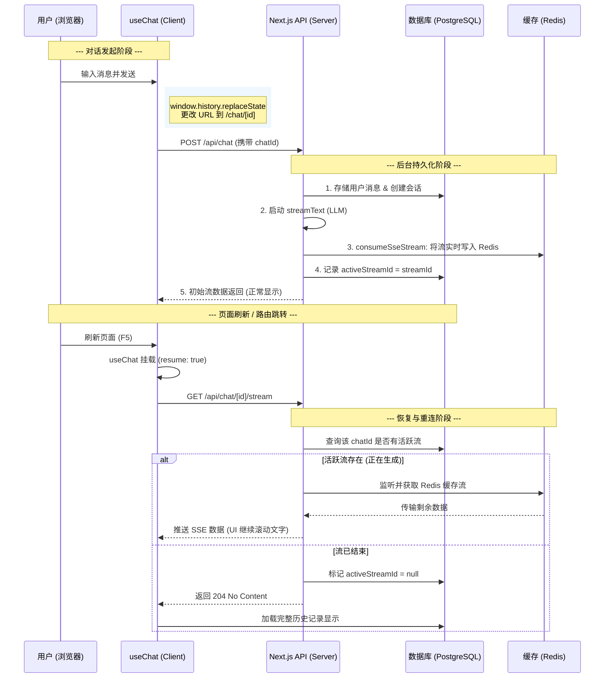

## 可恢复流

我们将这个过程分为三个阶段：**对话发起阶段**、**后台持久化阶段**、以及**恢复与重连阶段**。

### 1. 详细交互流程说明

#### 第一阶段：初始对话与无缝跳转 (Client Side)

1. **用户输入**：用户在首页输入框输入 Prompt 并点击发送。
2. **触发 `sendMessage`**：调用 `useChat` 的发送方法。
3. **静默跳转**：前端逻辑立即执行 `window.history.replaceState(null, "", /chat/${chatId})`。
    * *作用：* 地址栏瞬间变化，但 React 组件不卸载，当前正在进行的 Fetch 请求不会中断。
4. **Transport 路由**：`DefaultChatTransport` 根据当前状态，将请求路由至后台 `POST /api/chat`。

#### 第二阶段：后台创建与流捕获 (Server Side)

1. **接收请求**：后端 API 解析 `chatId` 和新消息。
2. **数据库预存**：将用户消息写入数据库。
3. **启动 LLM 任务**：调用 `streamText` 开始生成响应。
4. **流式写入缓存 (Redis)**：通过 `consumeStream` 回调：
    * 生成 `streamId` 并存入 Redis。
    * 在 DB 中将 `chatId` 与 `streamId` 绑定（标记为 `active`）。
5. **离线保障**：使用 Next.js 的 `after()` 函数。即使前端此时刷新导致连接断开，服务器也会在后台继续跑完 LLM 生成，并将结果完整写入 Redis。

#### 第三阶段：刷新/路由后的重连 (Client & Server)

1. **挂载检测**：用户刷新页面，`useChat` 重新挂载，检测到 `resume: true` 且有 `id`。
2. **发起恢复请求**：前端 Transport 自动调用 `GET /api/chat/[id]/stream`。
3. **状态判定**：后端查询数据库：
    * **情况 A (正在生成)**：从 Redis 中提取该 `streamId` 的实时进度，将后续数据通过 SSE 继续推送给前端。
    * **情况 B (已生成完毕)**：流已结束，返回 `204 No Content`，前端直接从数据库加载完整的历史消息。
4. **状态同步**：前端 UI 自动从“加载中”切换回“流式输入”状态，补全剩余文字。

---

### 2. 详细流程图 (Mermaid)

### 3. 核心机制总结

* **URL 不间断 (replaceState)**：防止了物理页面跳转导致的 React Context 丢失。
* **服务器后台化 (after / result.consumeStream)**：解决了“客户端断开导致服务端生成停止”的行业痛点。
* **Redis 作为总线**：它充当了正在生成的“流”的临时中转站。
* **状态幂等**：通过 `activeStreamId` 的存在与否，后端可以精确判断是该“开启重连”还是“告诉前端流已结束”。

这种模式能极大地提升用户体验，特别是在网络不稳或 AI 响应较长（如深度推理模型 DeepSeek R1/o1）的情况下。
